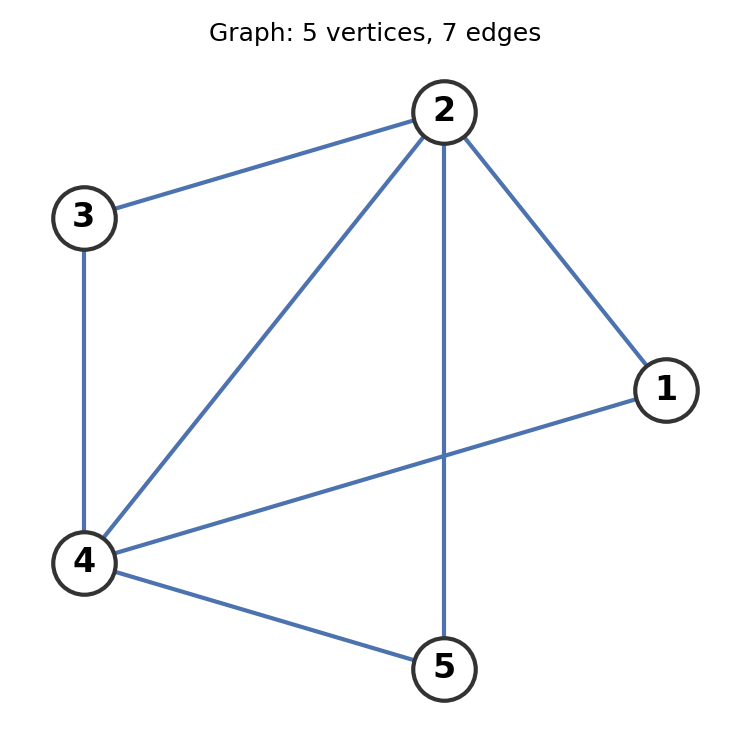

## Suggested Problems (suggested by Claude)

1. Let $F$ be a field. Show that if $x,y\in F$ and $xy=0$, then $x=0$ or $y=0$. (Hint: if $x\not=0$, multiply both sides by $x^{-1}$.) Where in this argument do you use the fact that $F$ is a field rather than, say, the ring of integers modulo $6$? What goes wrong in $\mathbf{Z}/6\mathbf{Z}$?

2. Let $V$ be the space of differentiable real-valued functions on $[0,1]$. Show directly (without appealing to the general axioms for $\mathbf{R}^n$) that $V$ is a vector space over $\mathbf{R}$, and explain why it is infinite dimensional.

3. Let $V$ be the solution space of the differential equation $f''-3f'+2f=0$ over $\mathbf{C}$. Using the fact that this space is 2-dimensional, find a basis for $V$, and use it to write down an isomorphism $\mathbf{C}^2\to V$.

4. Let $A$ be the matrix
$$
A = \begin{bmatrix} 1 & 2 & 1 & 0 \\ 2 & 4 & 0 & 1 \\ 1 & 2 & -1 & 1 \end{bmatrix}
$$
regarded as a linear map $L:\mathbf{R}^4\to\mathbf{R}^3$. Find bases for $\mathrm{null}(L)$ and $\mathrm{image}(L)$, and verify the rank-nullity formula $\dim(\mathrm{null}(L))+\dim(\mathrm{image}(L))=\dim(\mathbf{R}^4)$.

5. In $\mathbf{R}^4$, let
$$
U=\mathrm{Span}\{(1,0,1,0),(0,1,0,1)\}, \qquad W=\mathrm{Span}\{(1,1,0,0),(0,0,1,1)\}.
$$
Find a basis for $U+W$ and a basis for $U\cap W$, and check that
$$
\dim(U+W)=\dim(U)+\dim(W)-\dim(U\cap W).
$$
Is $U+W$ a direct sum?

6. Let $W=\{(x_1,x_2,x_3,x_4)\in\mathbf{R}^4 : x_1+x_2+x_3+x_4=0\}$. Describe the quotient space $\mathbf{R}^4/W$ explicitly, exhibit an isomorphism $\mathbf{R}^4/W\to \mathbf{R}$, and verify the dimension formula $\dim(\mathbf{R}^4/W)=\dim(\mathbf{R}^4)-\dim(W)$.

7. Consider the complex of real vector spaces
$$
0\to \mathbf{R} \xrightarrow{d_0} \mathbf{R}^3 \xrightarrow{d_1} \mathbf{R}^3 \xrightarrow{d_2} \mathbf{R} \to 0
$$
where $d_0(a)=(a,a,a)$, $d_1(x,y,z)=(x-y,y-z,z-x)$, and $d_2(x,y,z)=x+y+z$. Check that $d_1d_0=0$ and $d_2d_1=0$, so this really is a complex. Compute $H^0$, $H^1$, $H^2$, and $H^3$, and verify that the Euler characteristic $\chi=\sum(-1)^i\dim(W^i)$ agrees with $\sum(-1)^i\dim H^i$.

## Suggested Problems (suggested by JT)

1.  Let $V$ be the space of differentiable real-valued functions on $[0,1]$.  Let $\partial$ be the derivative operator $\partial(f) = f'$.  What is the null space of $f$?  How is this proved?

2.  Let $G$ be a finite graph (i.e. a finite set of vertices $V$, and a finite set of edges $E\subset V\times V$ where we think of an edge $(v_1,v_2)$ as going from  vertex $v_1$ to $v_2$.  We require that, whenever $(v_1,v_2)$ is an edge, so is $(v_2,v_1)$. 

For example:

{width=50%}

Now let $V^{0}$ be the space of real-valued functions $f:V\to \R$ and let $V^{1}$ be the space of real functions $f:E\to \R$ where $f((v_1,v_2))=-f((v_2,v_1))$.

Now define $d:V^{0}\to V^{1}$ by
$$
d(f)((v_1,v_2))=f(v_1)-f(v_2).
$$

and all other $V^{j}$ are the zero vector space with zero maps.  This is well-defined since 
$$
d(f)((v_2,v_1))=f(v_2)-f(v_1)=-(f(v_1)-f(v_2))=-d(f)(v_1,v_2).
$$

a. Describe a basis for $V^{0}$ and $V^{1}$. 
b. Describe the matrix of $d$ in this basis. 
c. What is the Euler Characteristic of this complex?  
d. What does it measure about the graph?  
e. By definition, $H^{0}$ of this complex is the kernel of $d$. Interpret
the elements of $H^{0}$ in terms of the graph.  What is the dimension of $H^{0}$?
e. By definition, $H^{1}$ of this complex is the quotient $V^{1}/B^{0}$
where $B^{0}$ is the image of $V^{0}$ in $V^{1}$.  Interpret the elements of this quotient space in terms of the graph.  What is the dimension of $H^{1}$?
