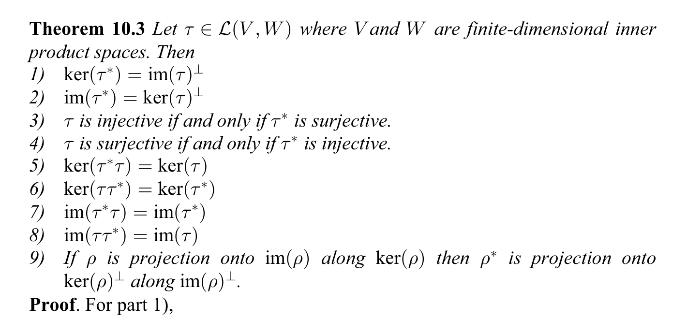

\newcommand{\image}{\mathrm{image}}
\newcommand{\ker}{\mathrm{ker}}

## Adjoints

For more details and exercises related to this material, see Chapter 10 of Roman's *Advanced Linear Algebra.*

Suppose $V$ and $W$ are finite dimensional inner product spaces (over $\R$ or $\C$).  We will use the bracket notation $\langle,\rangle$ for the inner products on both spaces.  Let $f:V\to W$ be a linear map.

**Proposition:** There is a unique linear map
$$
f^{*}:W\to V
$$
such that 
$$
\langle f(v),w\rangle = \langle v,f^{*}(w)\rangle
$$
for all $v\in V$ and $w\in W$.  The map $f^{*}$ is called the *adjoint* of $f$.

**Proof:** Let $v_1, \ldots, v_n$ be an orthonormal basis for $V$ and let $w_1,\ldots, w_m$ be an orthonormal basis for $W$.  If $f^{*}$ exists, it must satisfy
$$
\langle f(v_{i}),w_{j}\rangle = \langle v_{i},f^{*}(w_j)\rangle
$$
for all $1\le i\le n$ and $1\le j\le m$.  So let's
define
$$
f^{*}(w_{j})=\sum_{i=1}^{n} a_{i}v_{i}
$$
where
$$
a_{i} = \overline{\langle f(v_{i}),w_{j}\rangle}.
$$
This extends to a linear map $W\to V$ by linearity and it's clearly well-defined.  In addition
$$\begin{aligned}
\langle v_k,f^{*}(w_{j})\rangle &= 
\sum_{i=1}^{n} \overline{a_{i}}\langle v_{k},v_{i}\rangle \\
&=\overline{a_{k}} \\
&=\langle(f(v_{k}),w_{j})\rangle
$$
This shows that $f^{*}$ has the desired property (and also that $f^{*}$ is unique).

It is possible to prove the linearity of the adjoint without appealing to bases in this way; see Roman if you are interested in this. 

One consequence of the computation in the proof is
that if $E$ is an orthonormal basis for $V$ then
$$
[f]_{E}^{*} = \overline{[f]_{E}}^{\transpose}
$$.

To check this, we compute:
$$\begin{aligned}
\langle f(u),v\rangle &=
 ([f]_{E}[u]_{E})^{\top}\overline{[v]_{E}} \\
 &= [u]_{E}^{\top}[f]_{E}^{\top}\overline{[v]_{E}}\\
 &= [u]_{E}^{\top}\overline{[f]_{E}^{\top}[v]_{E}} \\
 &= \langle u,f^{*}(v)\rangle 
 \end{aligned}
 $$

The adjoint operation has the following properties.

\begin{enumerate}
\item $(f+g)^{*}=f^{*}+g^{*}$ and $(af)^{*}=\overline{a}f^{*}$.
\item $f^{**}=f$.
\item If $V=W$, then $(fg)^{*}=g^{*}f^{*}$.
\item If $f$ is invertible then $(f^{-1})^{*}=(f^{*})^{-1}.
\end{enumerate}

These all follow from the definition fairly easily.  Let's look at the third one.  Assume $V=W$.
Then
$$
\langle f(g(v)),w)\rangle = \langle(g(v),f^{*}(w))\rangle = \langle v,g^{*}f^{*}w\rangle
$$
so $(fg)^{*}=g^{*}f^{*}$.

#### Adjoints and orthogonality

As before, let $V$ and $W$ be finite dimensional inner product spaces and let $f:V\to W$ be a linear map.  Then we have the following properties (from [Roman, Advanced Linear Algebra](https://link.springer.com/book/10.1007/978-0-387-72831-5), Theorem 1.3, page 202. )

The proofs of these are applications of the definitions.  Here are a few proofs.

1.  $\ker(f^{*})=\image(f)^{\perp}$.  Suppose $w\in\ker(f^{*})$.  Then $\langle v,f^{*}w\rangle=0$ for all $v$.  Thus $\langle f(v),w \rangle$ is zero for all $v$, and therefore $w$ is in $\image(f)^{\perp}$.  Conversely, if $w\in\image(f)^{\perp}$.  Then $\langle f(v),w\rangle=0$ for all $v$, and then $\langle v,f^{*}w\rangle=0$ for all $v$.  Since the inner product is definite, this means $f^{*}w=0$ or $w\in\ker(f^{(*)})$.

3. $f$ is injective if and only if $f^{*}$ is surjective.  If $f$ is injective, then 
$\ker(f)=\image(f^{*})^{\perp}=0$ so $\image(f^{*})$
must be all of $V$.

5.  $\ker(f^{*}f)=\ker(f)$.  Clearly $\ker(f^{*}f)$ contains $\ker(f)$.  On the other hand, if $v\in \ker(f^{*}f)$,
then
$$
\langle f^{*}fv,v\rangle=\langle fv,fv \rangle = 0
$$
so $f(v)=0$. 

### Orthogonal and Unitary Diagonalizability