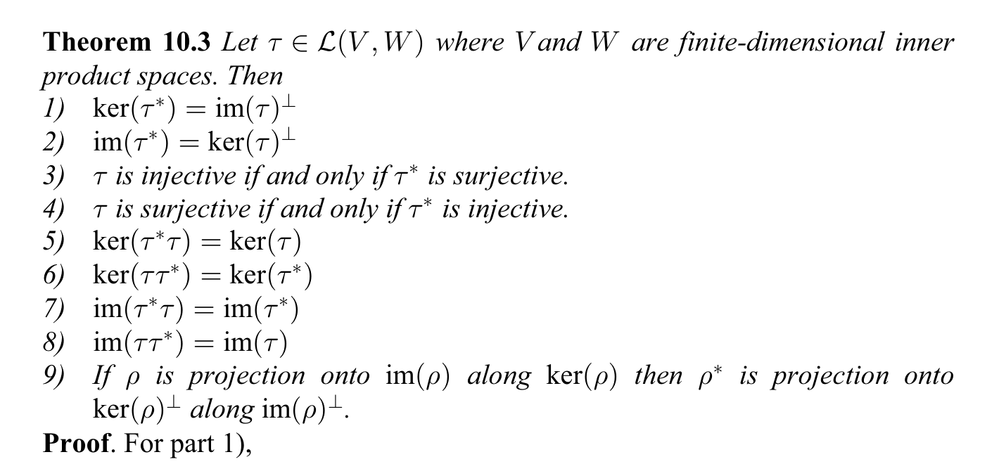

\newcommand{\image}{\mathrm{image}}
\newcommand{\C}{\mathbf{C}}
\newcommand{\R}{\mathbb{R}}

## Adjoints

For more details and exercises related to this material, see Chapter 10 of Roman's *Advanced Linear Algebra.*

Suppose $V$ and $W$ are finite dimensional inner product spaces (over $\R$ or $\C$).  We will use the bracket notation $\langle\cdot,\cdot\rangle$ for the inner products on both spaces.  Let $f:V\to W$ be a linear map.

**Proposition:** There is a unique linear map
$$
f^{*}:W\to V
$$
such that 
$$
\langle f(v),w\rangle = \langle v,f^{*}(w)\rangle
$$
for all $v\in V$ and $w\in W$.  The map $f^{*}$ is called the *adjoint* of $f$.

**Proof:** Let $v_1, \ldots, v_n$ be an orthonormal basis for $V$ and let $w_1,\ldots, w_m$ be an orthonormal basis for $W$.  If $f^{*}$ exists, it must satisfy
$$
\langle f(v_{i}),w_{j}\rangle = \langle v_{i},f^{*}(w_j)\rangle
$$
for all $1\le i\le n$ and $1\le j\le m$.  So let's
define
$$
f^{*}(w_{j})=\sum_{i=1}^{n} a_{i}v_{i}
$$
where
$$
a_{i} = \overline{\langle f(v_{i}),w_{j}\rangle}.
$$

This extends to a linear map $W\to V$ by linearity and it's clearly well-defined.  In addition
$$\begin{aligned}
\langle v_k,f^{*}(w_{j})\rangle &= 
\sum_{i=1}^{n} \overline{a_{i}}\langle v_{k},v_{i}\rangle \\
&=\overline{a_{k}} \\
&=\langle f(v_{k}),w_{j}\rangle
\end{aligned}
$$

This shows that $f^{*}$ has the desired property (and also that $f^{*}$ is unique).

It is possible to prove the linearity of the adjoint without appealing to bases in this way; see Roman if you are interested in this. 

One consequence of the computation in the proof is
that if $E$ is an orthonormal basis for $V$ then
$$
[f]_{E}^{*} = \overline{[f]_{E}}^{\top}
$$.

To check this, we compute:

$$
\begin{aligned}
\langle f(u),v\rangle &=
 ([f]_{E}[u]_{E})^{\top}\overline{[v]_{E}} \\
 &= [u]_{E}^{\top}[f]_{E}^{\top}\overline{[v]_{E}}\\
 &= [u]_{E}^{\top}\overline{\overline{[f]_{E}}^{\top}[v]_{E}} \\
 &= \langle u,f^{*}(v)\rangle 
 \end{aligned}
$$

The adjoint operation has the following properties.

- $(f+g)^{*}=f^{*}+g^{*}$ and $(af)^{*}=\overline{a}f^{*}$.
- $f^{**}=f$.
- If $V=W$, then $(fg)^{*}=g^{*}f^{*}$.
- If $f$ is invertible then $(f^{-1})^{*}=(f^{*})^{-1}$.

These all follow from the definition fairly easily.  Let's look at the third one.  Assume $V=W$.
Then
$$
\langle f(g(v)),w)\rangle = \langle g(v),f^{*}(w) \rangle = \langle v,g^{*}f^{*}w\rangle
$$

so $(fg)^{*}=g^{*}f^{*}$.

#### Adjoints and orthogonality

As before, let $V$ and $W$ be finite dimensional inner product spaces and let $f:V\to W$ be a linear map.  Then we have the following properties (from [Roman, Advanced Linear Algebra](https://link.springer.com/book/10.1007/978-0-387-72831-5), Theorem 10.3, page 202. )

The proofs of these are applications of the definitions.  Here are a few proofs.

**1.** $\ker(f^{*})=\image(f)^{\perp}$.  Suppose $w\in\ker(f^{*})$.  Then $\langle v,f^{*}w\rangle=0$ for all $v$.  Thus $\langle f(v),w \rangle$ is zero for all $v$, and therefore $w$ is in $\image(f)^{\perp}$.  Conversely, if $w\in\image(f)^{\perp}$, then $\langle f(v),w\rangle=0$ for all $v$, and then $\langle v,f^{*}w\rangle=0$ for all $v$.  Since the inner product is definite, this means $f^{*}w=0$, i.e. $w\in\ker(f^{*})$.

**3.** $f$ is injective if and only if $f^{*}$ is surjective.  If $f$ is injective, then
$\ker(f)=\image(f^{*})^{\perp}=0$ so $\image(f^{*})$
must be all of $V$.

**5.** $\ker(f^{*}f)=\ker(f)$.  Clearly $\ker(f^{*}f)$ contains $\ker(f)$.  On the other hand, if $v\in \ker(f^{*}f)$,
then
$$
\langle f^{*}fv,v\rangle=\langle fv,fv \rangle = 0
$$
so $f(v)=0$. 

### Orthogonal and Unitary Diagonalizability

In this section, we will return to the question of diagonalizability in the setting of inner product spaces.

**Definition:** Let $V$ be a (real or complex) inner product space of dimension $n$. A linear map $f:V\to V$ is *unitarily diagonalizable* (or *orthogonally diagonalizable* in the real case) if there is an orthonormal basis for $V$ consisting
of eigenvectors for $f$.  

Equivalently, $f$ is diagonalizable if $V$ can be written as a direct sum
$$
V = E(\lambda_1)\oplus E(\lambda_2)\oplus\cdots\oplus E(\lambda_k)
$$

where the $\lambda_j$ are distinct, each $E(\lambda_j)$ is an eigenspace for $f$ with eigenvalue $\lambda_j$,
and $E(\lambda_i)\perp E(\lambda_j)$ when $j\ne i$.

We would like to characterize unitarily diagonalizable matrices.  Notice that if $f$ is unitarily diagonalizable and
$E=\{u_1,\ldots, u_n\}$ is an orthonormal basis in which $[f]_{E}$ is diagonal, and $\lambda_j$ is the eigenvalue for $u_{j}$,
then the matrix $[f^{*}]_{E}$ of the adjoint $f^{*}$ is also diagonal with diagonal entries $\overline{\lambda_{j}}$.
As a result, $[f]_{E}$ and $[f^{*}]_{E}$ commute with one another, and therefore so do $f$ and $f^{*}$.

**Definition:** A linear map $f$ is called *normal* if $ff^{*}=f^{*}f$. 

We will ultimately establish that, for complex vector spaces,  the normal property characterizes unitarily diagonalizable maps.
Over the real numbers the characterization of normal matrices is somewhat more complicated. See Roman, Theorem 10.19, page 247.

**Proposition:**  Over $\C$, $f$ is normal if and only if it is unitarily  diagonalizable. 

We will work our way up to this result.  First, note that:

- the inverse of a normal operator is normal
- if $f$ is normal, so is $f^2$ (since $(f^2)^{*}f^2=f^{*}f^{*}ff=fff^{*}f^{*}$) and therefore so is any polynomial
$P(f)$ in $f$. 

It is not the case in general that a sum or product of two normal operators is normal.  

In addition, if $f$ is normal:

- If $f(v)=0$ then $f^{*}(v)=0$.  Because 
$$\langle f(v),f(v)\rangle=\langle v,f^{*}f(v)\rangle = \langle f^{*}(v),f^{*}(v)\rangle$$
- If $f^{k}(v)=0$ for $k\ge 1$ then $f(v)=0$.  For this, let $g=f^{*}f$.  The linear map $g$ has the property that 
$g^{*}=g$; it is *self-adjoint*.  Suppose $g^{k}(v)=0$ with $k>1$.  Then
$$
\langle g^{k}(v), g^{k-2}(v)\rangle = \langle g^{k-1}v, g^{k-1}v\rangle =0
$$
so $g^{k-1}v=0$.  Inductively it follows that $g(v)=0$.  Now if $f^{k}(v)=0$ for $k>1$, then
$$
g^{k}(v) = (f^{*})^{k}f^{k}(v)=0
$$
so $g(v)=0$ so $f^{*}f(v)=0$ and finally $\langle f(v), f(v)\rangle=0$ so $f(v)=0$. 
- The minimal polynomial of $f$ acting on $V$ is square free.
- If $v$ is an eigenvector for $f$ with eigenvalue $\lambda$, then $v$ is an eigenvector for $f^{*}$ with eigenvalue $\overline{\lambda}$.
- Eigenvectors $v$ and $w$ with distinct eigenvalues $\lambda$ and $\mu$ are orthogonal.  Because 
$$
\langle f(v),w\rangle = \lambda \langle v,w\rangle = \langle v,f^{*}(w)\rangle=\mu\langle v,w \rangle
$$
so if $\mu$ and $\lambda$ are different then $\langle v,w\rangle=0$.

Now we can show that, over the complex numbers, $f$ is normal if and only if it is
unitarily diagonalizable.

First, if $f$ is unitarily diagonalizable, there is an orthonormal basis of $V$ in which
$f$ is diagonal.  In this basis, $[f^{*}]=\overline{[f]}$ so clearly $f$ and $f^{*}$ commute.
Conversely, by the results above, the minimal polynomial of a normal matrix is square free
and factors over $\C$ into linear factors.  Therefore $f$ is diagonalizable.  In any fixed eigenspace we can choose an orthonormal basis, and since distinct eigenspaces are orthogonal
these combine to give an orthonormal basis of eigenvectors for $f$. 

**Remark:** Over $\R$, the minimal polynomial of a normal operator is square free,
but it may not factor into linear factors -- it factors into a combination of 
linear and degree two irreducible factors.  From this factorization, $V$ decomposes
into a sum of eigenspaces (corresponding to the real eigenvalues) and subspaces whose
minimal polynomial is of degree $2$.  One can say more about the factors corresponding
to the degree two factors and from this obtain the full result.  See Roman, Theorem 10.14, page 216.

### Self Adjoint Operators and Orthogonal Diagonalizability 

#### Self-adjoint operators

There are two particularly important subclasses of normal operators for our purposes.

**Definition:** A linear map $f$ is *self-adjoint* if $f^{*}=f$.  Notice that a self-adjoint map is obviously normal.

When working with real vector spaces, self-adjoint operators are a more natural class than normal operators.

The class of self-adjoint operators is:

- closed under addition, multiplication by *real* numbers, inverses, and *real* polynomials.

We also remark that  if $[f]$ is the matrix of a linear map with respect to an orthonormal basis $E$, then $f$ is self-adjoint 
if and only if $[f]$ is Hermitian, meaning that $[f]^{\top}=\overline{[f]}$. In particular
over a real vector space $[f]$ is symmetric. This is because
$$
[f]_{ij} = \langle f(u_{i}),u_{j}\rangle = \langle u_{i},f(u_{j})\rangle = \overline{\langle f(u_{j}),u_{i}\rangle} = \overline{[f]_{ji}}
$$

**Proposition:**  if $f$ is self-adjoint, then all of its eigenvalues are real. 

**Proof:** We could argue that, if $u$ is an eigenvector with
eigenvalue $\lambda$, then
$$
\langle f(u),u\rangle = \lambda \langle u,u\rangle = \langle u, f(u)\rangle = \overline{\lambda}\langle u, u\rangle
$$

so $\lambda=\overline{\lambda}$.
Strictly speaking, however, if $V$ is a real vector space, then we don't know *a priori* that $u$ is in $V$; it might have
complex entries.  We can work around this by choosing an orthonormal basis $E$ for $V$ and looking at the matrix $[f]_{E}$.
Since $f$ is self-adjoint, the matrix $X=[f]_{E}$ is symmetric and we can think of it as a Hermitian matrix that happens
to have real entries.  The argument above shows that a Hermitian matrix has real eigenvalues, so its characteristic polynomial
has only real roots.  But the characteristic polynomial of $X$ only depends on the entries of $X$, so the characteristic polynomial
of $f$ has only real roots. 

Since self-adjoint matrices are normal, if we put this together with our results on normal matrices, we see that
the minimal polynomial of a self-adjoint linear map $f$ factors into square free linear factors over the real numbers
(regardless of whether we're in the complex or real case).  Therefore we know that $f$ is diagonalizable. And since we know
that distinct eigenspaces are orthogonal, and we can find an orthonormal basis for each eigenspace, we have shown the following.

**Proposition:** Self-adjoint operators are unitarily diagonalizable over $\R$ (and conversely). 
Over $\C$, self-adjoint operators are unitarily diagonalizable with real eigenvalues (and conversely).  

### Unitary (or Orthogonal) operators

A linear map $f:V\to V$ is unitary (or, in the real case "orthogonal") if $f$
is invertible and $f^{*}=f^{-1}$.  Notice that this means that
$$
\langle f(v),f(w)\rangle = \langle v,f^{*}f(w)\rangle = \langle v,f^{-1}f(w)\rangle = \langle v,w\rangle
$$

for all $v,w\in V$.  So a unitary/orthogonal matrix preserves the inner product
and also the norm $\|v\|^2 = \langle v, v\rangle$. 

**Proposition:** Let $f$ be a unitary linear map.  Then:
- If $u_1,\ldots, u_n$ is an orthonormal basis, then so is
$$
f(u_1),\ldots, f(u_n)
$$
and, conversely,  if $f$ carries one orthonormal basis to another it is unitary.

It's clear from the definition that if $u_1,\ldots, u_n$ is orthonormal, so is $f(u_1),\ldots, f(u_n)$.
Conversely suppose that $f$ is any linear map and $u_1,\ldots, u_n$ is orthonormal.  Suppose that
$f(u_1),\ldots, f(u_n)$ is orthonormal.  Write $v=\sum a_{i}u_{i}$ and $w=\sum b_{i}u_{i}$ for two vectors $v$ and
$w$. Then
$$
\langle f(v),f(w)\rangle = \langle \sum a_{i}f(u_{i}),\sum b_{i}f(u_{i}) = \sum_{i,j} a_{i}\overline{b_{j}}\delta_{ij}=\langle v,w\rangle
$$ 
so $f$ is unitary.

- The eigenvalues of a unitary matrix have complex absolute value one.  This is because if $v$ is an eigenvector of $f$ with eigenvalue $\lambda$ then

$$
\langle f(v),f(v)\rangle = \lambda\overline{\lambda}\langle v,v\rangle
$$

so $\lambda\overline{\lambda}=1$.

- Suppose that $f$ is an invertible isometry, meaning that it is an invertible linear map and $\langle f(v),f(w)\rangle = \langle v,w\rangle$ for all pairs of vectors $v,w$.  Then
$f$ is unitary.

This is because
$$
\langle f(v), f(w)\rangle = \langle v, f^{*}f(w)\rangle = \langle v,w\rangle
$$.
This means $f^{*}f(w)=w$ (since for any $w$, $\langle v, f^{*}f(w)-w\rangle=0$ for all $v$ so the right side is zero.)
But $f^{*}f(w)=w$ means $f^{*}=f^{-1}$ so $f$ is unitary.

- Over the reals, $f$ is orthogonal if and only if $\|f(v)\|^2=\|v\|^2$ for all $v$.  This is because over the reals we have
the "parallelogram law":

$$
\langle v,w\rangle = \frac{1}{4}(\|v+w\|^2-\|v-w\|^2)
$$

**Proposition:** A matrix $A$ is unitary if and only $A^{\top}A=I$.  For unitary matrices:
- the rows (and columns) of $A$ form an orthonormal set.  
- the eigenvalues of a unitary (or orthogonal) matrix have complex absolute value 1. 
- the determinant of $A$ is of complex absolute value 1; over the reals,
an orthogonal matrix has determinant $\pm 1$.

### Orthogonal Projection

A linear map $L:V\to V$ is called a projection map if $L^2=L$.  This implies that:

- $L:\image(L)\to\image(L)$ is the identity map.
- If $v\in V$, then $L(v-LV)=0$ so $v-Lv\in \ker(L)$ and every vector $v=(v-Lv)+Lv\in \ker(L)+\image(L)$.
- If $v\in \ker(L)\cap \image(L)$, then $v=Lx$ so $Lv=Lx=0$ so $v=0$.  In other words the $V=\ker(L)\oplus\image(L)$. 

A projection is *orthogonal* if it is self-adjoint.  This is equivalent to saying that $\ker(L)$ and $\image(L)$ are orthogonal.
If $L$ is a self-adjoint projection, $x=Lu\in \image(L)$ and $y\in\ker(L)$ then

$$
\langle x, y\rangle = \langle Lu,y\rangle = \langle L^2u,y\rangle = \langle Lx, Ly\rangle  =0. 
$$

Conversely, if $\ker(L)$ and $\image(L)$ are orthogonal write $v=u+w$ and $v'=u'+w'$ where $u,u'\in\ker(L)$ and $w,w'=La,La'\in \image(L)$.
Then 
$$
\langle Lv,v'\rangle = \langle Lw, u'+w'\rangle =\langle Lw, w'\rangle = \langle w, w'\rangle = \langle w, Lw'\rangle = \langle v, Lv'\rangle
$$

If $L$ is normal over $\C$, and $V=E(\lambda_1)\oplus\cdots\oplus E(\lambda_{k})$ is the orthogonal decomposition of $V$ into $L$-eigenspaces,
we can construct an orthogonal set of projection maps $p_{i}$ onto $E(\lambda_{i})$.  Then
$$
L = \sum \lambda_{i}p_{i}
$$
is called the *spectral resolution* of $L$. 

If $L$ is self-adjoint over $\R$ it has a similar resolution with real eigenvalues.

**Proposition:** The projection operators $p_{i}$ are polynomials in $L$.  In fact, let $f_{i}(x)$ be the polynomial such that
$f_{i}(\lambda_{i})=1$ and $f_{i}(\lambda_{j})=0$ for $j\not= i$. Then $f_{i}(L)=p_{i}$.

### Positivity

A self-adjoint linear map $L:V\to V$ is called *positive* if the function
$$
Q_{L}(v) = \langle Lv, v\rangle \ge 0
$$
for all $v$, and positive definite if the inequality is strict unless $v=0$.

**Remark:** $Q_{L}(v)$ is real because $\overline{\langle Lv, v\rangle} = \langle v, Lv\rangle = \langle Lv, v\rangle$.

**Proposition:** $L$ is positive if all its eigenvalues are non-negative; and positive definite if they are all strictly positive.